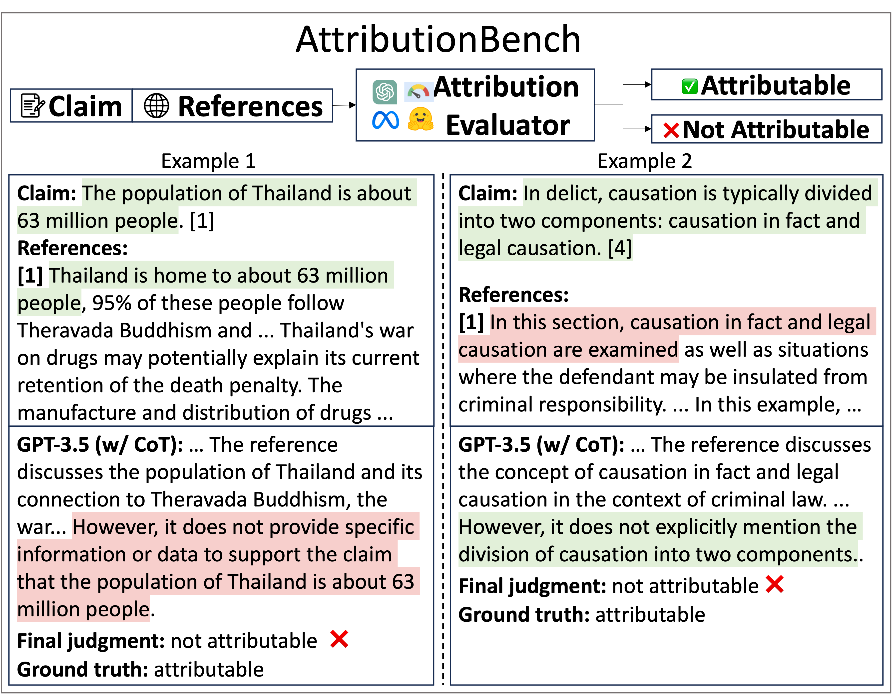

# AttributionBench
Code and datasets for the paper "AttributionBench: How Hard is Automatic Attribution Evaluation?".



### Updates:
02/26/24: We have made the initial release of our code and data. Please feel free to open an issue if you run into any problems.

## Dataset
We constructed this dataset from multiple existing data sources in a unified format, in order to create a unified and diverse testbed for evaluating advanced attribution evaluation systems. The dataset contains both in-domain training set and id-domain and out-of-domain test set.

## Usage
```python
import datasets

features = datasets.Features({
  'question': datasets.Value('string'),
  'claim': datasets.Value('string'),
  'claim_raw_string': datasets.Value('string'),
  'response': datasets.Value('string'),
  'references': datasets.Sequence(datasets.Value("string")),
  'citation_links': datasets.Sequence(datasets.Value("string")),
  'webpage_references': datasets.Sequence(datasets.Value("string")),
  'attribution_label': datasets.Value('string'),
  'src_dataset': datasets.Value('string'),
  'id': datasets.Value('string'),
  })

# in-domain train (subset-balanced)
# possible values for 'name' field: ["subset_balanced", "overall_balanced", "not_balanced", "full_data"]
dataset = datasets.load_dataset("osunlp/AttributionBench", name="subset_balanced", split="train", features=features)

# in-domain eval/test (subset-balanced)
# dataset = datasets.load_dataset("osunlp/AttributionBench", name="subset_balanced", split="test", features=features)
dataset = datasets.load_dataset("osunlp/AttributionBench", name="subset_balanced", split="test", features=features)

# out-of-domain test (subset-balanced)
dataset = datasets.load_dataset("osunlp/AttributionBench", name="subset_balanced", split="test_ood", features=features)
```

## Dataset Structure
### Data Instances
```json
{
  "question":"Is the number of horses living on Easter Island twice the number of people?",
  "claim":"According to James Grant-Peterkin in his book \u201cA Companion to Easter Island\u201d, there are almost 3,000 horses on Easter Island. However, locals often claim that they have more horses than people. The population of Easter Island is about 6,000 inhabitants. So it seems that the number of horses living on Easter Island is not twice the number of people.",
  "claim_raw_string":"According to James Grant-Peterkin in his book \u201cA Companion to Easter Island\u201d, there are almost 3,000 horses on Easter Island. However, locals often claim that they have more horses than people. The population of Easter Island is about 6,000 inhabitants. So it seems that the number of horses living on Easter Island is not twice the number of people.",
  "response":"According to James Grant-Peterkin in his book \u201cA Companion to Easter Island\u201d, there are almost 3,000 horses on Easter Island. However, locals often claim that they have more horses than people. The population of Easter Island is about 6,000 inhabitants. So it seems that the number of horses living on Easter Island is not twice the number of people.",
  "references":[
    "It is worth mentioning the huge population of horses (about 6,000) that already outnumber people and roam free on the island."
  ],
  "citation_links":[],
  "webpage_references":[],
  "attribution_label":"not attributable",
  "src_dataset":"AttrScore-GenSearch",
  "id":"AttrScore-GenSearch_7234d6e9-1f51-4203-9587-f539e34d34f4"
}
```
### Data Fields
- ```question```: ```str``` The question proposed by the user.
- ```claim```: ```str``` Part of the response to the question. Could be one single sentence or multiple sentences.
- ```claim_raw_string```: ```str``` The raw string of the claim from the original datasets before being processed.
- ```response```: ```str``` The response to the question generated by LMs or generative search engines.
- ```references```: ```List[str]``` A list of documents or paragraphs which could support the claim.
- ```citation_links```: ```Optional[List[str]]``` Reserved field for citation links.
- ```webpage_references```: ```Optional[List[str]]``` Reserved field for the webpage contents of the reference links.
- ```attribution_label```: ```str``` "attributable" or "not attributable".
- ```src_dataset```: ```str``` The source dataset of the data item.
- ```id```: ```str``` The unique id for the data item in AttributionBench.

## Prompting GPT-3.5 and GPT-4
To reproduce the results of prompting GPT-3.5 in the paper, you need to put an OpenAI api key in the ```openai_api_key.txt``` file, and change the hyperparameters in ```run.sh```, and then simply do
```python
sh run.sh
```
## Fine-tuning GPT-3.5
You can use our fine-tuned GPT-3.5 model with this model name:
```ft:gpt-3.5-turbo-1106:the-ohio-state-university::8eWuGzGQ```
Please simply replace the ```model``` field into this model name when calling OpenAI api. For example:
```python
response = openai.ChatCompletion.create(
    model='ft:gpt-3.5-turbo-1106:the-ohio-state-university::8eWuGzGQ',
    messages=messages,
    temperature=0,
    top_p=0.9,
    max_tokens=512,
    n=1
)
```


## Fine-tuning & Inference with Open-Source Models
For fine-tuning models on AttributionBench, please refer to the scripts under the ```scripts/``` directory. For example, if you want to fine-tune FLAN-T5, then simply do:
```shell
cd zsh_scripts
sh run_flant5.sh
sh run_autoais.sh
sh run_llama2_7b.sh
sh run_roberta.sh
```
Please modify the hyperparameters and paths before you do so.

For inference, please first replace the ```$MODEL_DIR``` in ```run_inference.sh```, and do
```shell
sh run_inference.sh
```
This will generate the output files consisting of model generations. After getting a bunch of inferenced files, simply do
```shell
sh analysis.sh
```
And the the evaluation results (accuracy, precision, recall, f1) will be generated.

## Citation
<section class="section" id="BibTeX">
    <div class="container is-max-desktop content">
      <h2 class="title">Reference</h2>
      Please kindly cite our paper if you use our code, data, or results:
      <pre><code>@misc{li2024attributionbench,
            title={AttributionBench: How Hard is Automatic Attribution Evaluation?}, 
            author={Yifei Li and Xiang Yue and Zeyi Liao and Huan Sun},
            year={2024},
            eprint={2402.15089},
            archivePrefix={arXiv},
            primaryClass={cs.CL}
      }
      </code></pre>
      If used, please also cite the original datasets accordingly:
      <pre><code>@misc{malaviya2023expertqa,
        title={ExpertQA: Expert-Curated Questions and Attributed Answers}, 
        author={Chaitanya Malaviya and Subin Lee and Sihao Chen and Elizabeth Sieber and Mark Yatskar and Dan Roth},
        year={2023},
        eprint={2309.07852},
        archivePrefix={arXiv},
        primaryClass={cs.CL}
      }
      </code></pre>
      <pre><code>@inproceedings{liu-etal-2023-evaluating,
          title = "Evaluating Verifiability in Generative Search Engines",
          author = "Liu, Nelson  and
            Zhang, Tianyi  and
            Liang, Percy",
          editor = "Bouamor, Houda  and
            Pino, Juan  and
            Bali, Kalika",
          booktitle = "Findings of the Association for Computational Linguistics: EMNLP 2023",
          month = dec,
          year = "2023",
          address = "Singapore",
          publisher = "Association for Computational Linguistics",
          url = "https://aclanthology.org/2023.findings-emnlp.467",
          doi = "10.18653/v1/2023.findings-emnlp.467",
          pages = "7001--7025",
          abstract = "Generative search engines directly generate responses to user queries, along with in-line citations. A prerequisite trait of a trustworthy generative search engine is verifiability, i.e., systems should cite comprehensively (high citation recall; all statements are fully supported by citations) and accurately (high citation precision; every cite supports its associated statement). We conduct human evaluation to audit four popular generative search engines{---}Bing Chat, NeevaAI, perplexity.ai, and YouChat{---}across a diverse set of queries from a variety of sources (e.g., historical Google user queries, dynamically-collected open-ended questions on Reddit, etc.). We find that responses from existing generative search engines are fluent and appear informative, but frequently contain unsupported statements and inaccurate citations: on average, a mere 51.5{\%} of generated sentences are fully supported by citations and only 74.5{\%} of citations support their associated sentence. We believe that these results are concerningly low for systems that may serve as a primary tool for information-seeking users, especially given their facade of trustworthiness. We hope that our results further motivate the development of trustworthy generative search engines and help researchers and users better understand the shortcomings of existing commercial systems.",
      }
    </code></pre>
      <pre><code>@misc{bohnet2023attributed,
          title={Attributed Question Answering: Evaluation and Modeling for Attributed Large Language Models}, 
          author={Bernd Bohnet and Vinh Q. Tran and Pat Verga and Roee Aharoni and Daniel Andor and Livio Baldini Soares and Massimiliano Ciaramita and Jacob Eisenstein and Kuzman Ganchev and Jonathan Herzig and Kai Hui and Tom Kwiatkowski and Ji Ma and Jianmo Ni and Lierni Sestorain Saralegui and Tal Schuster and William W. Cohen and Michael Collins and Dipanjan Das and Donald Metzler and Slav Petrov and Kellie Webster},
          year={2023},
          eprint={2212.08037},
          archivePrefix={arXiv},
          primaryClass={cs.CL}
    }
    </code></pre>
      <pre><code>@misc{chen2023understanding,
          title={Understanding Retrieval Augmentation for Long-Form Question Answering}, 
          author={Hung-Ting Chen and Fangyuan Xu and Shane Arora and Eunsol Choi},
          year={2023},
          eprint={2310.12150},
          archivePrefix={arXiv},
          primaryClass={cs.CL}
    }
    </code></pre>
      <pre><code>@article{dziri-etal-2022-evaluating,
      title = "Evaluating Attribution in Dialogue Systems: The {BEGIN} Benchmark",
      author = "Dziri, Nouha  and
        Rashkin, Hannah  and
        Linzen, Tal  and
        Reitter, David",
      editor = "Roark, Brian  and
        Nenkova, Ani",
      journal = "Transactions of the Association for Computational Linguistics",
      volume = "10",
      year = "2022",
      address = "Cambridge, MA",
      publisher = "MIT Press",
      url = "https://aclanthology.org/2022.tacl-1.62",
      doi = "10.1162/tacl_a_00506",
      pages = "1066--1083",
      abstract = "Knowledge-grounded dialogue systems powered by large language models often generate responses that, while fluent, are not attributable to a relevant source of information. Progress towards models that do not exhibit this issue requires evaluation metrics that can quantify its prevalence. To this end, we introduce the Benchmark for Evaluation of Grounded INteraction (Begin), comprising 12k dialogue turns generated by neural dialogue systems trained on three knowledge-grounded dialogue corpora. We collect human annotations assessing the extent to which the models{'} responses can be attributed to the given background information. We then use Begin to analyze eight evaluation metrics. We find that these metrics rely on spurious correlations, do not reliably distinguish attributable abstractive responses from unattributable ones, and perform substantially worse when the knowledge source is longer. Our findings underscore the need for more sophisticated and robust evaluation metrics for knowledge-grounded dialogue. We make Begin publicly available at \url{https://github.com/google/BEGIN-dataset}.",
  }
    </code></pre>
      <pre><code>@inproceedings{yue-etal-2023-automatic,
      title = "Automatic Evaluation of Attribution by Large Language Models",
      author = "Yue, Xiang  and
        Wang, Boshi  and
        Chen, Ziru  and
        Zhang, Kai  and
        Su, Yu  and
        Sun, Huan",
      editor = "Bouamor, Houda  and
        Pino, Juan  and
        Bali, Kalika",
      booktitle = "Findings of the Association for Computational Linguistics: EMNLP 2023",
      month = dec,
      year = "2023",
      address = "Singapore",
      publisher = "Association for Computational Linguistics",
      url = "https://aclanthology.org/2023.findings-emnlp.307",
      doi = "10.18653/v1/2023.findings-emnlp.307",
      pages = "4615--4635",
      abstract = "A recent focus of large language model (LLM) development, as exemplified by generative search engines, is to incorporate external references to generate and support its claims. However, evaluating the attribution, i.e., verifying whether the generated statement is fully supported by the cited reference, remains an open problem. Although human evaluation is common practice, it is costly and time-consuming. In this paper, we investigate automatic evaluation of attribution given by LLMs. We begin by defining different types of attribution errors, and then explore two approaches for automatic evaluation: prompting LLMs and fine-tuning smaller LMs. The fine-tuning data is repurposed from related tasks such as question answering, fact-checking, natural language inference, and summarization. We manually curate a set of test examples covering 12 domains from a generative search engine, New Bing. Our results on this curated test set and simulated examples from existing benchmarks highlight both promising signals and challenges. We hope our problem formulation, testbeds, and findings will help lay the foundation for future studies on this important problem.",
  }
    </code></pre>
      </code></pre>
      <pre><code>@misc{kamalloo2023hagrid,
    title={HAGRID: A Human-LLM Collaborative Dataset for Generative Information-Seeking with Attribution}, 
    author={Ehsan Kamalloo and Aref Jafari and Xinyu Zhang and Nandan Thakur and Jimmy Lin},
    year={2023},
    eprint={2307.16883},
    archivePrefix={arXiv},
    primaryClass={cs.CL}
}
  </code></pre>